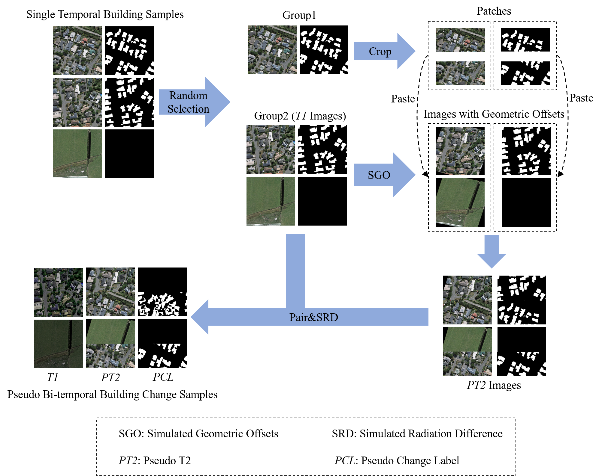

## A Building Change Detection Framework with Patch-Pairing Single-temporal Supervised Learning and Metric Guided Attention Mechanism  

A PyTorch 1.8 implementation of PPSL and MGFDNet with ResNet18
* The proposed framework:  


* Pairing Single-temporal Supervised Learning (PPSL):  




---

### Requirements


1. Python >= 3.6
2. [PyTorch](https://pytorch.org/get-started/locally/) >= 1.8.0
3. torchvision >=0.9.0
4. numpy
5. matplotlib
6. tqdm
7. pillow

---
### Usage

### 0. Data Preparation
All image data are cropped to 512×512 pixels. The datasets are placed in the "datasets" folder and organized as follows:
```
datasets
    ┣━WHU-BD
    ┃    ┣━image
    ┃    ┃     
    ┃    ┃  
    ┃    ┣━label
    ┃    ┃
    ┃    ┃ 
    ┃
    ┃
    ┣━WHU-BCD
    ┃    ┃  
    ┃    ┣━val
    ┃    ┃    ┣━A
    ┃    ┃    ┣━B
    ┃    ┃    ┗━change
    ┃    ┗━test
    ┃         ┣━A
    ┃         ┣━B
    ┃         ┗━change
    ┃
    ┃ 
    ┗━...
```

### 1. Training
train the model like this:
>   python train.py

